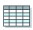

#Economics - Cost of Ownership

**Use the peak heating and cooling loads, utility rates, and weather data (based on location) to calculate the estimated cost of operation for the GSHP system and compare it to another conventional heating and cooling system.**

##Type of Analysis

**Retrofit:** Leave this box unchecked if the analysis being performed is for a project where the cost of the GSHP system will be included in the mortgage. Check this box if the cost of the new system will be separately paid for or financed. 

**Conventional Heating & Cooling System:** Select the conventional heating and cooling system for direct comparison against the financing cost and cost of ownership with a GSHP system.

**Year N:** Define the number of years from 5 to 30 for which you would like to analyze the system's Cost of Ownership.

**Account for System Life Cycle:** Leave this box unchecked if life cycle cost is to be ignored in this analysis. Check this box by clicking on it to account for the life cycle cost for each system. By including life cycle cost in the calculations, the life expectancy and associated future equipment replacement costs will be accounted for. When life cycle costs are included, the cost of ownership calculated for each system will more closely resemble the actual cost of ownership given that reasonable assumptions are used for the analysis.

##Installation Cost Details
**Installation Cost:** Specify the estimated total installation cost for the selected conventional system and for the GSHP system, including ductwork, circulating pumps for the GSHP system, etc. 

**Incentives:** If incentives (rebates, federal tax incentives, etc) are available for either system, specify the amount for each. 

**Actual Cost:** The actual cost calculated to be installation cost less incentives.

##Fuel Inflation & Installation Costs
Specify the fuel inflation rates, installation costs, and incentives to install each type of system. 

**Fuel Inflation Rate:** Specify the estimated annual fuel inflation rates for the selected conventional heating and cooling system and for the GSHP system. 

**Installation Cost:** Specify the estimated total installation cost for the selected conventional system and for the GSHP system, including ductwork, circulating pumps for the GSHP system, etc. 

**Incentives:** If incentives (rebates, federal tax incentives, etc) are available for either system, specify the amount for each.

##Initial Purchase Loan Details

Specify the loan terms for each system. 

**Loan Interest Rate:** Specify the fixed annual interest rate on the loan for both heating and cooling systems. Occasionally, a lower interest rate is offered by the local electric company in exchange for installing a GSHP system. 

**Loan Term:** Specify the loan term for each system. Enter a value of 0 for the loan term if financing is not used and a lump sum payment is made. 

**Loan Amount:** The calculated loan amount for each heating and cooling system, calculated to be the actual cost to install each system minus the down payment on the loan. 

**Down Payment:** Specify the down payment amount (if any) on the loan for each system. 

**Monthly Payment:** The calculated monthly payment (principal and interest) for each loan.

##Mortgage Details

**Home Purchase Price:** Specify the purchase price of the new home. This purchase price is assumed to include the cost of the conventional heating and cooling system selected for comparison. 

**Down Payment:** Specify the down payment amount on the new home. 

**Mortgage Interest Rate:** Specify the fixed annual mortgage interest rate on the new home. 

**Term:** Specify the mortgage loan term (typically 15 or 30 years).

###Conventional Heating and Cooling System

**Total Mortgage:** The actual amount to be financed for the new home with the conventional heating and cooling system, calculated to be the home purchase price minus the down payment.

##Loan Savings
###Retrofit Checked (for Retrofit/Equipment Replacement Projects)
**Monthly Operating Cost Savings:** The monthly operating cost savings for the GSHP system over the conventional heating and cooling system, calculated to be the monthly cost to operate the GSHP system minus the monthly cost to operating the conventional heating and cooling system. 

**Incremental Loan Payment:** The incremental monthly loan payment for the GSHP system, calculated to be the monthly loan payment with the GSHP system minus the monthly loan payment for the conventional heating and cooling system. 

**Monthly Savings from GSHP:** The total monthly savings associated with installing the GSHP system as opposed to the conventional heating and cooling system, calculated by taking the monthly operating cost savings minus the incremental loan payment. If this number is positive, the customer will see positive cash flow instantly by purchasing the GSHP system (due to the monthly operating cost savings being higher than the incremental monthly loan payment.)

#Mortgage Savings
###Retrofit Unchecked (for New Build Projects)
**Monthly Operating Cost Savings:** The monthly operating cost savings for the GSHP system over the conventional heating and cooling system, calculated to be the monthly cost to operate the GSHP system minus the monthly cost to operating the conventional heating and cooling system. 

**Incremental Mortgage Payment:** The incremental monthly mortgage payment for the new home with the GSHP system, calculated to be the monthly mortgage payment with the GSHP system minus the monthly mortgage payment for the conventional heating and cooling system. 

**Monthly Savings from GSHP:** The total monthly savings associated with installing the GSHP system as opposed to the conventional heating and cooling system, calculated by taking the monthly operating cost savings minus the incremental mortgage payment. If this number is positive, the customer will see positive cash flow instantly by purchasing the GSHP system and including the associated cost of that system into the mortgage (due to the monthly operating cost savings being higher than the incremental monthly mortgage payment.)

##Simple Payback
**Simple Payback Period:** The amount of time (in years) necessary to recoup the additional cost spent on the GSHP system in annual energy savings. Simple payback period is calculated by dividing the incremental cost of installing the GSHP system by the annual operating cost savings over the conventional heating and cooling system selected for comparison. 

##Equipment Replacement Details
**Service Life:** Specify the life expectancy for the mechanical equipment for each system. 

Most air source equipment, namely central air conditioning units and ASHPs have service life of 10-15 years. Most gas- or oil-fired furnace equipment has life expectancy of 15-20 years. Most GSHP equipment has life expectancy values of 25-30 years. Ground heat exchanger HDPE piping and associated components has life expectancy of 25-50 years. 

 ***Click on the Table Icon to view service life estimates for various types of HVAC-related equipment, materials and mechanical components.*** 

**Loan Interest Rate:** Specify the fixed annual interest rate on the replacement loan for both heating and cooling systems. Occasionally, a lower interest rate is offered by the local electric company in exchange for installing a GSHP system. 

**Loan Term:** Specify the replacement loan term for each system. Enter a value of 0 for the replacement loan term if financing is not used and a lump sum payment is made. 

**Equipment Cost:** Specify the estimated replacement cost for each system as a percentage of the original equipment cost. 

For conventional heating and cooling systems, the replacement cost will be approximately 60-80% of the original cost of the system. The components that will not usually need to be replaced will be ductwork and thermostats. These components are part of the original cost of the system and must not be included in the equipment replacement cost. 

For the GSHP system, the replacement cost will typically be 40-60% of the original cost. The components that will not usually need to be replaced will be ductwork, thermostats, ground heat exchanger piping (plus associated components), and interior piping (plus associated components). These components are part of the original cost of the system and must not be included in the equipment replacement cost. 

**Equipment Inflation:** Enter the expected 30-year inflation rate applied to future replacement costs of the equipment. 

**Down Payment:** Specify the down payment amount on the replacement loan for each system.

##N Year Savings

**Total Savings (After N Years):** The calculated savings associated with purchasing the GSHP system as opposed to the conventional heating and cooling system over a 30-year time period.

The total savings after N years includes the original cost of the equipment (as part of the original home mortgage payment), estimated inflation rates for the cost of energy (specified on the **FUEL INFLATION and INSTALLATION COSTS** section of this page), and the life cycle cost for both types of equipment (specified on the **EQUIPMENT REPLACEMENT DETAILS** section of this page). Life cycle costs are only considered when the **Account for System Life Cycle** box is checked and appropriate data is supplied.

##Cost of Ownership Analysis

View the total cost of ownership for the selected conventional heating and cooling system and for the GSHP system including the original purchase price, operating cost (including the specified energy inflation rates), and life cycle costs (if the **Account for System Life Cycle** box is selected). The data is presented both in graphical and in tabular format.