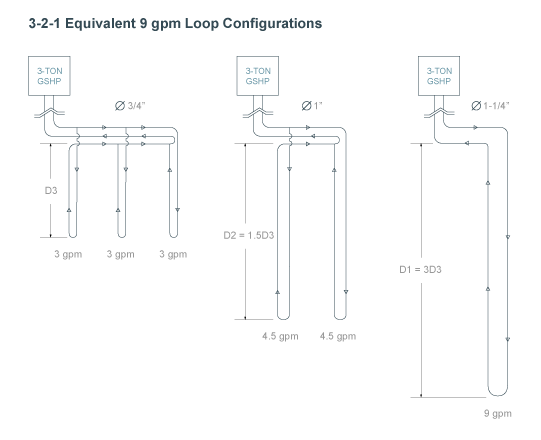
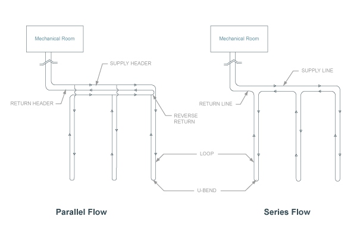

#Horizontal Bore GHEX Design
**Use the previously entered climatic data, peak heating and cooling loads, and GSHP performance data to design a horizontally-bored ground heat exchanger (GHEX).** 

**Name:** The name given to the horizontally-bored GHEX design, saved in the GHEX section within the sidebar navigation panel. Use the name to differentiate between multiple designs for comparison.

##Earth Temperature Data Location

**Country/State/City:** Select the location nearest to the actual project location. Soil temperature data is imported and used to design the horizontally-bored GHEX.

##Soil Details
**Soil Thermal Conductivity:** The thermal conductivity (Btu/hr-ft-F) of the soil. Soil conductivity is dependent on soil type, moisture content, and density. Thermal conductivity is a measure of how fast heat moves through a material due to a temperature difference. 

**Soil Thermal Diffusivity:** The thermal diffusivity (ft2/day) of the soil. Soil diffusivity is dependent on soil type, moisture content, and density. Thermal diffusivity is a measure of how fast heat moves relative to the heat storage capacity of the material.

**Calculate Estimate:** Click this button to open an interactive calculator that will enable you to estimate your formation thermal properties based on a selected soil type.

For more information on soil properties, refer to Section 5.2.2.2 and Table 5.6 (Chapter 5, pages 26-29) in IGSHPA's *Ground Source Heat Pump Residential and Light Commercial Design and Installation Guide.* 

Users in the U.S.A. may reference the [USDA Printed Surveys](http://soils.usda.gov/survey/printed_surveys) for detailed soil information by state and county.

##Layout Details
**Bore Diameter:** The diameter of the borehole being drilled for insertion of the GHEX piping. Common borehole diameters range from 4"-6", depending on drilling conditions and the size of the u-bend piping being utilized. 

**Pipe Diameter:** The u-bend pipe diameter to be used in the active section of the vertically-bored GHEX. Choose between 3/4", 1", and 1-1/4" u-bend pipe diameters. 

***Refer to the figure below to view the correlation between u-bend pipe diameter, vertical bore depth, and gpm per flow path:*** 
 

For more information about proper pipe selection, refer to Section 5.1.3 and Figures 5.4-5.5 (Chapter 5, pages 5-8) in IGSHPA's *Ground Source Heat Pump Residential and Light Commercial Design and Installation Guide.* 

**Layout Rows:** The number of rows to be used in the vertically-bored GHEX layout. A 2x3 [rows x bores per row] rectangular loopfield layout would have 2 rows with 3 bores in each row for a total of 6 bores. 

**Bores per Row:** The number of bores in each row to be used in the vertically-bored GHEX layout. A 2 x 3 [rows x bores per row] rectangular loopfield layout would have 2 rows with 3 bores in each row for a total of 6 bores. 

**Bore Spacing:** The center-center spacing between bores. 

**Number of Bores in Series:** The number of bores in series before the circuit is attached to the header. Use 1 for a value for a basic parallel-type GHEX configuration. Adjust the value (>1) when a series-parallel system is used. A series-type GHEX configuration is not recommended. 

***Refer to the figure below to view the difference between a system with 1-, 2-, and 3-bores-in-series.***
 

***Refer to the figure below to view the difference between the series-type and the parallel-type GHEX configurations:*** 
 

**Grout Thermal Conductivity:** The thermal conductivity (Btu/hr-ft-F) of the grouting material to be placed into the borehole after insertion of the u-bend. Thermal conductivity is a measure of how fast heat moves through a material due to a temperature difference. 

**Avg. Pipe Depth:** The average installation depth of the horizontally-bored GHEX. If one row is installed at a depth of 10 feet and a second is installed at a depth of 20 feet, the average pipe installation depth would be 15 feet.

##Fixed Length Mode
Check this box to use **Fixed Length Mode**. When enabled, specify the target bore length and configuration (number of bores, bore spacing, grout thermal conductivity, etc. and the program will calculate the minimum and maximum EWT's that will be supplied by the specified ground heat exchanger configuration. 

**Fixed Length Mode** is only available for one GHEX configuration per project. All other GHEX design calculations will be performed such that they will provide the same EWT's as the configuration with **Fixed Length Mode** Enabled.

##GHEX Summary
**Number of Bores:** The total number of bores in the GHEX, calculated by taking the number of rows multiplied by the number of bores per row. 

**Bore Multiplier:** This parameter is used to account for long-term draw-down or build-up of energy in the loopfield in unbalanced ground load situations. Bore multiplier is a function of the normalized net annual ground load, GHEX design (bore layout, number of bores, and center-center spacing) and soil properties (thermal conductivity and thermal diffusivity). 

**NNAGL (Normalized Net Annual Ground Load):** The net annual ground load divided by the design length (unadjusted for long-term effects) and the temperature difference between the deep earth and the average circulating fluid under design conditions. This parameter is used to determine the bore multiplier (see Bore Mult. below) to account for long-term draw-down or build-up of energy in the loopfield in unbalanced ground load situations. 

**GPM per Flow Path:** The design flow rate (gpm, gallons per minute) through each parallel flow path in the GHEX. The system should be designed such that the design flow rate is approximately 3 gpm per flow path for 3/4" u-bends, 4.5 gpm per flow path for 1" u-bends, and 6-9 gpm per flow path for 1-1/4" u-bends. 

**Number of Flow Paths:** The total number of parallel flow paths in the GHEX, calculated by taking the total number of bores divided by the number of bores in series. 

**System Flow Rate:** The total system flow rate (gpm, gallons per minute) to be circulated through the GHEX, determined by the flow rate required by the GSHP equipment selected to serve the zones in the system.
###Heating
**EWTmin:** The minimum entering water temperature the closed-loop ground connection will be designed to provide under peak heating conditions, typically assumed to be 30 degrees F in heating-dominant applications. This parameter is specified on the **PROJECT DETAILS** page. 

**Soil Temp:** The temperature of the soil at the average pipe burial depth during peak heating conditions (at the end of January). Soil temperature is a function of average pipe burial depth, soil type, and time of year when the installation depth is less than 15 feet below grade. When average pipe burial depth is 20 feet below grade (or more), soil temperature is constant throughout the year. 

***Refer to the figure below to see how soil temperature in Chicago, IL varies with depth and time of year for a given soil type:*** 
 

For more information on soil temperature swing through the year, refer to Section 5.3.2.1, Table 5.11 and Figures 5.21-5.23 (Chapter 5, pages 52-59) in IGSHPA's *Ground Source Heat Pump Residential and Light Commercial Design and Installation Guide.* 

**Ground Loop Resistance:** The heat transfer resistance (hr-ft-F/Btu) in the borehole in the heating mode. Bore resistance is a function of run fraction during the heating design month (January), bore diameter, u-bend pipe diameter, spacing of the pipes in the borehole, formation thermal conductivity, and grout thermal conductivity. 

**System Run Fraction:** A measure of equipment run-time during the design month in heating (January), expressed as a decimal. A 0.600 run fraction means that the equipment will run approximately 60% of the time during the design month. Run fraction is a function of equipment capacity as it relates to building load and weather data for the geographical location. 

**Bore Length:** The length of each bore required to maintain the minimum entering water temperature given the parameters used to design the GHEX in the heating mode during the first year of system operation. This parameter does not account for unbalanced ground loads. 

**Adjusted Bore Length:** The length of each bore required to accommodate unbalanced ground loads over the long term while maintaining the specified minimum entering water temperature in the heating mode. 

Imbalanced annual ground loads can result in a long-term ground temperature increase or decrease at the center of the loopfield. This temperature change reduces heat exchanger capacity. The **Adjusted Bore Length** is the individual bore length required to account for this temperature change, which typically occurs within the first 10 years of system operation. Designing with this length ensures that the maximum and minimum entering water temperatures to the heat pumps (EWT's) stay within specification 10 years after system startup or until steady state conditions are achieved. This length does not take into account groundwater movement in the vertical or horizontal directions.
###Cooling
**EWTmax:** The maximum entering water temperature the closed-loop ground connection will be designed to provide under peak cooling conditions, typically assumed to be 90 degrees F in cooling-dominant applications. This parameter is specified on the **PROJECT DETAILS** page. 

**Soil Temp:** The temperature of the soil at the average pipe burial depth during peak cooling conditions (at the end of July). Soil temperature is a function of average pipe burial depth, soil type, and time of year when the installation depth is less than 15 feet below grade. When average pipe burial depth is 20 feet below grade (or more), soil temperature is constant throughout the year. 

**Ground Loop Resistance:** The heat transfer resistance (hr-ft-F/Btu) in the borehole in the cooling mode. Bore resistance is a function of run fraction during the cooling design month (July), bore diameter, u-bend pipe diameter, spacing of the pipes in the borehole, formation thermal conductivity, and grout thermal conductivity. 

**System Run Fraction:** A measure of equipment run-time during the design month in cooling (July), expressed as a decimal. A 0.600 run fraction means that the equipment will run approximately 60% of the time during the design month. Run fraction is a function of equipment capacity as it relates to building load and weather data for the geographical location. 

**Bore Length:** The length of each bore required to maintain the maximum entering water temperature given the parameters used to design the GHEX in the cooling mode during the first year of system operation. This parameter does not account for unbalanced ground loads. 

**Adjusted Bore Length:** The length of each bore required to accommodate unbalanced ground loads over the long term while maintaining the specified maximum entering water temperature in the cooling mode. 

Imbalanced annual ground loads can result in a long-term ground temperature increase or decrease at the center of the loopfield. This temperature change reduces heat exchanger capacity. The **Adjusted Bore Length** is the individual bore length required to account for this temperature change, which typically occurs within the first 10 years of system operation. Designing with this length ensures that the maximum and minimum entering water temperatures to the heat pumps (EWT's) stay within specification 10 years after system startup or until steady state conditions are achieved. This length does not take into account groundwater movement in the vertical or horizontal directions. 

***The GHEX design length for a given system will be determined by whichever design is dominant (i.e. - whichever GHEX design length is longer).*** 

All design length calculations are performed according to the procedures given in Section 5.4 (Chapter 5, pages 80-96) in IGSHPA's *Ground Source Heat Pump Residential and Light Commercial Design and Installation Guide.* 

