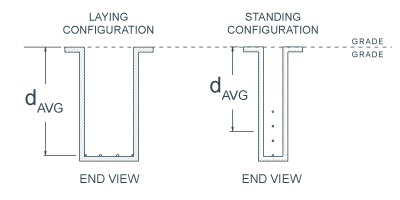
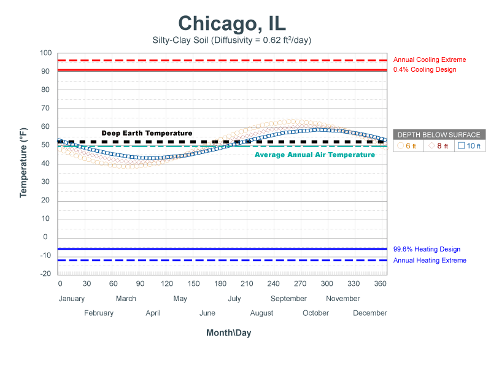

#Horizontal Trench GHEX Design
**Use the previously entered climatic data, peak heating and cooling loads, and GSHP performance data to design a horizontally-trenched ground heat exchanger (GHEX).** 

**Name:** The name given to the horizontally-trenched GHEX design, saved in the GHEX section within the sidebar navigation panel. Use the name to differentiate between multiple designs for comparison. 

##Earth Temperature Data Location

**Country/State/City:** Select the location nearest to the actual project location. Soil temperature data is imported and used to design the horizontally-trenched GHEX.

##Soil Details
**Soil TC (Thermal Conductivity):** The thermal conductivity (Btu/hr-ft-F) of the soil. Soil TC is dependent on soil type, moisture content, and density. Thermal conductivity is a measure of how fast heat moves through a material due to a temperature difference. 

**Soil Diffusivity:** The thermal diffusivity (ft2/day) of the soil. Soil diffusivity is dependent on soil type, moisture content, and density. Thermal diffusivity is a measure of how fast heat moves relative to the heat storage capacity of the material. 

**Soil Calculator:** Click to open the Soil Calculator to estimate soil thermal conductivity and thermal diffusivity values.

##Soil Properties Estimator
Use the Soil Properties Estimator to lookup and then assign estimated soil thermal conductivity and thermal diffusivity values.

**Soil Density:** Specify the density level that represents the long term condition of the soil after it has settled from installation.

**Moisture Content:** Specify the moisture content level that represents the most conservative (driest) long term condition of the soil for the life of the system.

**Suggested Soil Types:** Use USDA's Web Soil Survey to perform a lookup of the soil type in the area. Then choose the soil type from the provided interactive table that most closely resembles the actual soil type found in the USDA lookup.
Refer to <a href="http://blog.geoconnectionsinc.com/2017/04/soil-identification-for-horizontal-geo.html" target="_blank">this article</a> for more information on using USDA's Web Soil Survey to find and assign properties.

Table of Soil Properties</h1>

<table border="1" cellspacing="0" cellpadding="0" style="background-color:#FFF;">
	<thead>
 <tr>
 <td rowspan="2" >Soil1</td>
 <td colspan="3" >USDA System2</td>
 <td >Field Density Class3</td>
 <td colspan="2" >Soil Moisture</td>
 <td colspan="2" >Thermal Conductivity4 (Btu/hr ft F)</td>
 <td colspan="2" >Thermal Diffusivity5 (ft2/day)</td>
 </tr>
 <tr>
 <td height="39">Sand 
  (%)</td>
 <td>Silt 
  (%)</td>
 <td>Clay 
  (%)</td>
 <td>(g/cm3-lb/ft3)</td>
 <td>W.P.</td>
 <td>F.C.</td>
 <td>W.P.</td>
 <td>F.C.</td>
 <td>W.P.</td>
 <td>F.C.</td>
 </tr>
 </thead>
	<tbody>
 <tr>
 <td rowspan="3" >Benclare 
  (Clay)</td>
 <td rowspan="3">1.7</td>
 <td rowspan="3">25.5</td>
 <td rowspan="3">72.9</td>
 <td>L (1.10-68.8)</td>
 <td rowspan="3">30.1</td>
 <td>39.9</td>
 <td>0.42</td>
 <td>0.55</td>
 <td>0.29</td>
 <td>0.33</td>
 </tr>
 <tr>
 <td>M (1.20-75.1)</td>
 <td>37.2</td>
 <td>0.51</td>
 <td>0.62</td>
 <td>0.33</td>
 <td>0.36</td>
 </tr>
 <tr>
 <td>H (1.30-81.4)</td>
 <td>35.1</td>
 <td>0.63</td>
 <td>0.70</td>
 <td>0.37</td>
 <td>0.38</td>
 </tr>
 <tr>
 <td rowspan="3" >Sharpsburg  
  (Silty-Clay-Loam)</td>
 <td rowspan="3">3.5</td>
 <td rowspan="3">58.2</td>
 <td rowspan="3">38.3</td>
 <td>L (1.30-81.4)</td>
 <td rowspan="3">16.5</td>
 <td>31.3</td>
 <td>0.39</td>
 <td>0.77</td>
 <td>0.32</td>
 <td>0.45</td>
 </tr>
 <tr>
 <td >M (1.40-87.6)</td>
 <td>28.6</td>
 <td>0.53</td>
 <td>0.79</td>
 <td>0.41</td>
 <td>0.46</td>
 </tr>
 <tr>
 <td>H (1.50-93.6)</td>
 <td>26.5</td>
 <td>0.64</td>
 <td>0.83</td>
 <td>0.46</td>
 <td>0.47</td>
 </tr>
 <tr>
 <td rowspan="3" >Moody 
  (Silty-Loam)</td>
 <td rowspan="3">12.5</td>
 <td rowspan="3">65.6</td>
 <td rowspan="3">21.9</td>
 <td>L (1.40-87.6)</td>
 <td rowspan="3">9.1</td>
 <td>23.5</td>
 <td>0.40</td>
 <td>0.75</td>
 <td>0.39</td>
 <td>0.49</td>
 </tr>
 <tr>
 <td>M (1.50-93.9)</td>
 <td>21.7</td>
 <td>0.48</td>
 <td>0.83</td>
 <td>0.43</td>
 <td>0.52</td>
 </tr>
 <tr>
 <td>H (1.60-100)</td>
 <td>20.1</td>
 <td>0.60</td>
 <td>0.92</td>
 <td>0.50</td>
 <td>0.58</td>
 </tr>
 <tr>
 <td rowspan="3" >Cecil 
  (Clay)</td>
 <td rowspan="3">35.0</td>
 <td rowspan="3">17.8</td>
 <td rowspan="3">47.2</td>
 <td>L (1.40-87.6)</td>
 <td rowspan="3">17.7</td>
 <td>26.6</td>
 <td>0.79</td>
 <td>1.07</td>
 <td>0.57</td>
 <td>0.64</td>
 </tr>
 <tr>
 <td>M (1.50-93.9)</td>
 <td>24.6</td>
 <td>0.97</td>
 <td>1.12</td>
 <td>0.67</td>
 <td>0.66</td>
 </tr>
 <tr>
 <td>H (1.60-100)</td>
 <td>23.0</td>
 <td>1.09</td>
 <td>1.18</td>
 <td>0.71</td>
 <td>0.68</td>
 </tr>
 <tr>
 <td rowspan="3" >Kranzburg 
  (Clay-Loam)</td>
 <td rowspan="3">35.5</td>
 <td rowspan="3">36.4</td>
 <td rowspan="3">28.1</td>
 <td>L (1.50-93.9)</td>
 <td rowspan="3">11.5</td>
 <td>21.7</td>
 <td>0.60</td>
 <td>0.90</td>
 <td>0.50</td>
 <td>0.57</td>
 </tr>
 <tr>
 <td>M (1.60-100)</td>
 <td>20.2</td>
 <td>0.73</td>
 <td>1.00</td>
 <td>0.58</td>
 <td>0.62</td>
 </tr>
 <tr>
 <td>H (1.70-106)</td>
 <td>18.7</td>
 <td>0.88</td>
 <td>1.05</td>
 <td>0.65</td>
 <td>0.58</td>
 </tr>
 <tr>
 <td rowspan="3" >Brookings 
  (Sandy-Clay-Loam)</td>
 <td rowspan="3">45.6</td>
 <td rowspan="3">22.7</td>
 <td rowspan="3">31.8</td>
 <td>L (1.50-93.9)</td>
 <td rowspan="3">13.1</td>
 <td>21.1</td>
 <td>0.64</td>
 <td>1.03</td>
 <td>0.50</td>
 <td>0.65</td>
 </tr>
 <tr>
 <td>M (1.60-100)</td>
 <td>19.6</td>
 <td>0.80</td>
 <td>1.05</td>
 <td>0.60</td>
 <td>0.66</td>
 </tr>
 <tr>
 <td>H (1.70-106)</td>
 <td>18.1</td>
 <td>0.93</td>
 <td>1.05</td>
 <td>0.65</td>
 <td>0.65</td>
 </tr>
 <tr>
 <td rowspan="3" >Grovena 
  (Sandy-Loam)</td>
 <td rowspan="3">53.4</td>
 <td rowspan="3">35.3</td>
 <td rowspan="3">11.3</td>
 <td>L (1.50-93.9)</td>
 <td rowspan="3">4.9</td>
 <td>13.6</td>
 <td>0.40</td>
 <td>0.81</td>
 <td>0.42</td>
 <td>0.64</td>
 </tr>
 <tr>
 <td>M (1.60-100)</td>
 <td>13.4</td>
 <td>0.51</td>
 <td>0.92</td>
 <td>0.51</td>
 <td>0.68</td>
 </tr>
 <tr>
 <td>H (1.70-106)</td>
 <td>12.6</td>
 <td>0.62</td>
 <td>1.04</td>
 <td>0.58</td>
 <td>0.75</td>
 </tr>
 <tr>
 <td rowspan="3" >Vienna  
  (Sandy-Loam)</td>
 <td rowspan="3">66.5</td>
 <td rowspan="3">21.0</td>
 <td rowspan="3">12.5</td>
 <td>L (1.50-93.9)</td>
 <td rowspan="3">5.9</td>
 <td>15.6</td>
 <td>0.47</td>
 <td>0.92</td>
 <td>0.48</td>
 <td>0.68</td>
 </tr>
 <tr>
 <td>M (1.60-100)</td>
 <td>15.4</td>
 <td>0.62</td>
 <td>0.97</td>
 <td>0.60</td>
 <td>0.68</td>
 </tr>
 <tr>
 <td>H (1.70-106)</td>
 <td>14.6</td>
 <td>0.74</td>
 <td>1.05</td>
 <td>0.67</td>
 <td>0.72</td>
 </tr>
 <tr>
 <td rowspan="3" >Lamoure 
  (Sandy-Loam) or 
  (Loamy-Sand)</td>
 <td rowspan="3">78.9</td>
 <td rowspan="3">11.4</td>
 <td rowspan="3">9.7</td>
 <td>L (1.60-100)</td>
 <td rowspan="3">4.2</td>
 <td>12.1</td>
 <td>0.47</td>
 <td>0.87</td>
 <td>0.48</td>
 <td>0.68</td>
 </tr>
 <tr>
 <td>M (1.70-106)</td>
 <td>11.9</td>
 <td>0.65</td>
 <td>1.10</td>
 <td>0.63</td>
 <td>0.80</td>
 </tr>
 <tr>
 <td>H (1.80-113)</td>
 <td>11.1</td>
 <td>0.80</td>
 <td>1.21</td>
 <td>0.74</td>
 <td>0.87</td>
 </tr>
 <tr>
 <td rowspan="3" >Maddock 
  (Loamy-Sand)</td>
 <td rowspan="3">87.6</td>
 <td rowspan="3">5.6</td>
 <td rowspan="3">6.8</td>
 <td>L (1.60-100)</td>
 <td rowspan="3">3.3</td>
 <td>11.7</td>
 <td>0.42</td>
 <td>0.97</td>
 <td>0.45</td>
 <td>0.77</td>
 </tr>
 <tr>
 <td>M (1.70-106)</td>
 <td>11.5</td>
 <td>0.49</td>
 <td>1.07</td>
 <td>0.50</td>
 <td>0.80</td>
 </tr>
 <tr>
 <td>H (1.80-113)</td>
 <td>10.7</td>
 <td>0.50</td>
 <td>1.20</td>
 <td>0.48</td>
 <td>0.87</td>
 </tr>
 <tr>
 <td rowspan="3" >Fordville 
  (Sand)</td>
 <td rowspan="3">100.0</td>
 <td rowspan="3">0.0</td>
 <td rowspan="3">0.0</td>
 <td>L (1.60-100)</td>
 <td rowspan="3">0.70</td>
 <td>5.0</td>
 <td>0.20</td>
 <td>0.71</td>
 <td>0.25</td>
 <td>0.71</td>
 </tr>
 <tr>
 <td>M (1.70-106)</td>
 <td>5.0</td>
 <td>0.28</td>
 <td>0.95</td>
 <td>0.32</td>
 <td>0.89</td>
 </tr>
 <tr>
 <td>H (1.80-113)</td>
 <td>5.1</td>
 <td>0.39</td>
 <td>1.04</td>
 <td>0.42</td>
 <td>0.92</td>
 </tr>
 </tbody>
</table>
*Source: Remund (1998 a , b)*

<ol>
 <li class="citation">Soil series name - USDA textural class included in parenthesis.</li>
 <li class="citation"> According to USDA System sand, silt, and clay particle size limits.</li>
 <li class="citation"> M - average dry density for field soils below approximately 6 feet with indicated USDA particle size breakdown and should be used unless better information is available. L and H indicate one standard deviation below and above average, respectively.</li>
 <li class="citation"> Wilting point (W.P.) thermal conductivity is lowest expected value in the field. Field Capacity (F.C.) thermal conductivity is highest expected value in the field, except for saturated condition.</li>
 <li class="citation"> Wilting point (W.P.) thermal diffusivity is lowest expected value in the field. Field Capacity (F.C.) thermal diffusivity is highest expected value in the field, except for saturated condition.</li>
</ol>

For more information on soil properties, refer to Section 5.3.2.2 and Table 5.15 (Chapter 5, pages 59-62) in IGSHPA's *Ground Source Heat Pump Residential and Light Commercial Design and Installation Guide.* 

Users in the U.S.A. may reference the [USDA Printed Surveys](http://soils.usda.gov/survey/printed_surveys) for detailed soil information by state and county.

##Piping Details
**GHEX Configuration:** The type of horizontally-trenched GHEX configuration to be installed. 

**Pipe Configuration:** When a selection is made, the corresponding trench detail and loop configuration diagram is displayed. 

**Trench/Track Width:** The width of the selected piping configuration. When multiple values are possible, a dropdown will appear. 

**Trench/Pit Depth:** The depth of the trench/pit to be excavated. 

**C-C Spacing/Pit Width:** The center to center spacing between trenches for Standard and Slinky configurations or the overall pit width for Racetrack configurations. 

**Pipe Material:** The material from which the pipe is made.  Different materials exhibit different resistance to heat transfer as a result the selection of material will impact loop lengths.

**Pipe Nominal Diameter:** The nominal diameter of pipe used in the active section of the GHEX. The available diameters will vary depending on the piping material selected.

**Flow Paths per Trench/Pit:** The number of parallel flow paths per trench. When multiple values are possible, a dropdown will appear. 

**Number of Trenches/Pits:** The total number of trenches or pits to install. Total flow paths is calculated as the product of Flow Paths per Trench/Pit and Number of Trenches/Pits. 

**Horizontal Spacing:** The spacing between individual pipe runs in the trench, calculated based on trench/track width for the selected Pipe Configuration. This field will only appear when applicable.

##Fixed Length Mode
Check this box to use **Fixed Length Mode**. When enabled, specify the target trench/pit length and configuration (number of flow paths, C-C spacing/pit width, trench/pit depth, etc. and the program will calculate the minimum and maximum EWT's that will be supplied by the specified ground heat exchanger configuration. 

**Fixed Length Mode** is only available for one GHEX configuration per project. All other GHEX design calculations will be performed such that they will provide the same EWT's as the configuration with **Fixed Length Mode** Enabled.

##GHEX Summary
**Number of Trenches:** The total number of trenches required to build the GHEX, calculated by taking the number of flow paths divided by the number of flow paths per trench. 

**Average Burial Depth:** The average pipe burial depth of the horizontally-trenched GHEX. If the pipe is laid flat in the bottom of the trench (laying configuration), the average pipe burial depth will be equal to the trench depth. If the pipe is standing in the trench (standing configuration), the average pipe burial depth will be at the center of the standing configuration. 

***Refer to the following figure to view the correlation between pipe configuration and average pipe burial depth:*** 

**Soil Resistance:** The heat transfer resistance (hr-ft-F/Btu) in the horizontally-trenched GHEX. Soil resistance is a function of loop pipe diameter, spacing and configuration of the pipes in the trench, the center-center spacing between trenches, the number of trenches to be installed, and soil thermal conductivity. 

For more information on soil resistance, refer to Tables 5.17-5.29 (Chapter 5, pages 64-69) in IGSHPA's *Ground Source Heat Pump Residential and Light Commercial Design and Installation Guide.* 

**GPM per Flow Path:** The design flow rate (gpm, gallons per minute) through each parallel flow path in the GHEX. The system should be designed such that the design flow rate is approximately 3 gpm per flow path for 3/4" horizontal loops, 4.5 gpm per flow path for 1" horizontal loops, and 6-9 gpm per flow path for 1-1/4" horizontal loops. 

**Number of Flow Paths:** The total number of parallel flow paths in the GHEX. 

**System Flow Rate:** The total system flow rate (gpm, gallons per minute) to be circulated through the GHEX, determined by the flow rate required by the GSHP equipment selected to serve the zones in the system.

###Heating
**EWTmin:** The minimum entering water temperature the closed-loop ground connection will be designed to provide under peak heating conditions, typically assumed to be 30 degrees F in heating-dominant applications. This parameter is specified on the **PROJECT DETAILS** page. 

**Soil Temp:** The temperature of the soil at the average pipe burial depth during peak heating conditions (at the end of January). Soil temperature is a function of average pipe burial depth, soil type, and time of year when the installation depth is less than 15 feet below grade. 

***Refer to the figure below to see how soil temperature in Chicago, IL varies with depth and time of year for a given soil type:*** 
 

For more information on soil temperature swing through the year, refer to Section 5.3.2.1, Table 5.11 and Figures 5.21-5.23 (Chapter 5, pages 52-59) in IGSHPA's *Ground Source Heat Pump Residential and Light Commercial Design and Installation Guide.* 

**System Run Fraction:** A measure of equipment run-time during the design month in heating (January), expressed as a decimal. A 0.600 run fraction means that the equipment will run approximately 60% of the time during the design month. Run fraction is a function of equipment capacity as it relates to building load and weather data for the geographical location. 

**Total Pipe Length:** The total pipe length required to maintain the minimum entering water temperature given the parameters used to design the GHEX in the heating mode. 

**Pipe Length per Trench:** The length of pipe to be installed in each trench to maintain the minimum entering water temperature given the parameters used to design the GHEX in the heating mode, calculated by dividing the total heating pipe length by the number of trenches in the system. 

**Individual Trench Length:** The length of each trench necessary to install the amount of pipe required by the design, calculated by dividing the heating pipe length per trench by the pipe density of the selected configuration (feet of pipe per foot of trench).

###Cooling
**EWTmax:** The maximum entering water temperature the closed-loop ground connection will be designed to provide under peak cooling conditions, typically assumed to be 90 degrees F in cooling-dominant applications. This parameter is specified on the **PROJECT DETAILS** page. 

**Soil Temp:** The temperature of the soil at the average pipe burial depth during peak cooling conditions (at the end of July). Soil temperature is a function of average pipe burial depth, soil type, and time of year when the installation depth is less than 15 feet below grade. 

**System Run Fraction:** A measure of equipment run-time during the design month in cooling (July), expressed as a decimal. A 0.600 run fraction means that the equipment will run approximately 60% of the time during the design month. Run fraction is a function of equipment capacity as it relates to building load and weather data for the geographical location. 

**Total Pipe Length:** The total pipe length required to maintain the maximum entering water temperature given the parameters used to design the GHEX in the cooling mode. 

**Pipe Length per Trench:** The length of pipe to be installed in each trench to maintain the maximum entering water temperature given the parameters used to design the GHEX in the cooling mode, calculated by dividing the total cooling pipe length by the number of trenches in the system. 

**Individual Trench Length:** The length of each trench necessary to install the amount of pipe required by the design, calculated by dividing the cooling pipe length per trench by the pipe density of the selected configuration (feet of pipe per foot of trench). 

***The GHEX design length for a given system will be determined by whichever design is dominant (i.e. - whichever GHEX design length is longer).*** 

All design length calculations are performed according to the procedures given in Section 5.3 (Chapter 5, pages 49-79) in IGSHPA's *Ground Source Heat Pump Residential and Light Commercial Design and Installation Guide.*