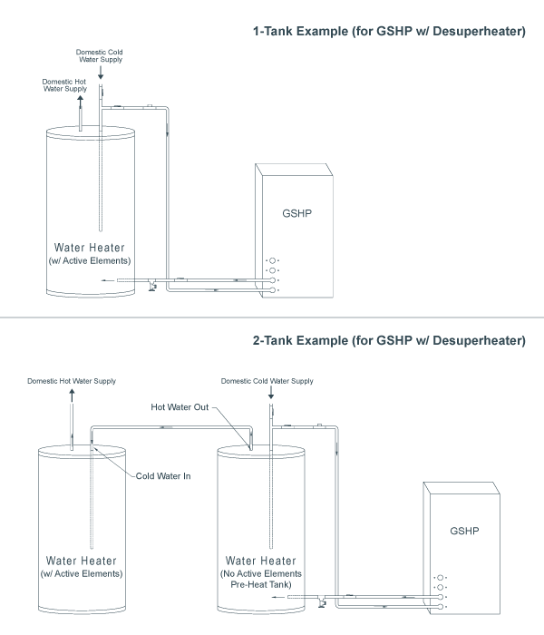

#Hot Water Generation (HWG)
**If the GSHP system will be used to generate some (supplemental) or all (on demand or full-condensing) of the domestic hot water for the project, specify system type and hot water usage details to calculate the cost savings associated with doing so. Also, view the parameters that affect ground heat exchanger performance which will affect overall ground heat exchanger design lengths.**

##System Options
**Method of Operation:** Specify the method used for hot water generation with the GSHP system. There are four options to choose from, which will only be available when applicable: 

**1. None** - Domestic HWG is optional for any GSHP system and does not need to be utilized. If domestic hot water will not be generated with the GSHP equipment, select this option. When **None** is selected, HWG calculations will be turned off. 

**2. Desuperheater** - Select this option if domestic HWG is to be provided with a desuperheater in a supplemental capacity. When supplemental HWG with a desuperheater is used, the GSHP system will generate some (less than 100%), but not all of the required hot water. The actual percentage of domestic hot water made with the GSHP system will depend on the hot water usage profile as it relates to the building load profile and the storage system that is utilized. Additionally, when this option is selected, a conventional HWG system will need to be utilized to meet the portion of the hot water requirements that the GSHP HWG system will not satisfy by itself. 

**3. On Demand** - Select this option if domestic HWG is to be provided with dedicated GSHP equipment with the domestic HWG set as the primary function and space heating/cooling set as the secondary function on the equipment control board. When domestic HWG is set as the primary function of a given GSHP unit, the GSHP system will generate all (100%) of the required hot water. 

**Independent Unit** - Check this box if an independent unit will be used for domestic HWG. A unit is considered to be independent if its only function will be to generate hot water. If a GSHP unit will be used for HWG but also for space heating and cooling in the zone(s), the unit is not independent (leave this box unchecked). 

**4. Water-Water w/ Space Priority** - Select this option if domestic HWG is to be provided with dedicated GSHP equipment with space heating and cooling set as the primary function and domestic HWG set as the secondary function on the equipment control board. When spacing heating and cooling is set as the primary function for a given GSHP unit, the GSHP system will generate some (less than 100%), but not all of the required hot water. The actual percentage of domestic hot water made with the GSHP system will depend on the hot water usage profile as it relates to the building load profile and the storage system that is utilized. Additionally, when this option is selected, a conventional HWG system will need to be utilized to meet the portion of the hot water requirements that the GSHP HWG system will not satisfy by itself. 

For more information on domestic hot water options, refer to Section 9.1 (Chapter 9, pages 1-16) in IGSHPA's *Ground Source Heat Pump Residential and Light Commercial Design and Installation Guide.*

##Hot Water Generation Details
Specify parameters which affect energy usage, operating cost & savings, for HWG with the GSHP system. The options available in this section will depend on the method of operation specified in the **System Options** section. 

**Number of Storage Tanks:** Specify whether a 1-tank or 2-tank hot water storage system is to be used. This option will only be available when applicable (Dedicated GSHP w/ Space Htg/Clg Priority and GSHP w/ Desuperheater only). 

***Refer to the figure below to view the difference between 1-tank and 2-tank storage systems:*** 
 
***NOTE: A HWG system that utilizes a pre-heat tank with an inline tankless water heater will have operating characteristics similar to the 2-tank storage system shown in the figure.*** 

The illustrations above are Figure 9.13 (page 9-14) and Figure 9.14 (page 9-15) from IGSHPA's *Ground Source Heat Pump Residential and Light Commercial Design and Installation Guide.* 

**% of DHW Generated Annually:** Specify the percentage of the annual domestic hot water requirements that will be satisfied by the GSHP HWG system. For a 1-Tank hot water storage system, the percentages will be between 40%-60% for the Dedicated GSHP w/ Space Htg/Clg Priority option and between 20%-40% for the GSHP w/ Desuperheater option. For a 2-Tank hot water storage system, the percentages will be between 60%-80% for the Dedicated GSHP w/ Space Htg/Clg Priority option and between 40%-80% for the GSHP w/ Desuperheater option. The remainder of the domestic hot water will need to be generated by the conventional system. This option will only be available when applicable (Dedicated GSHP w/ Space Htg/Clg Priority and GSHP w/ Desuperheater only). 

**% of DHW Generated in Design Month:** Specify the percentage of the domestic hot water requirements that will be satisfied by the GSHP HWG system during the design month. For a 1-Tank hot water storage system, the percentages will be between 50%-70% for the Dedicated GSHP w/ Space Htg/Clg Priority option and between 30%-50% for the GSHP w/ Desuperheater option. For a 2-Tank hot water storage system, the percentages will be between 70%-90% for the Dedicated GSHP w/ Space Htg/Clg Priority option and between 50%-100% for the GSHP w/ Desuperheater option. The remainder of the domestic hot water will need to be generated by the conventional system. This option will only be available when applicable (Dedicated GSHP w/ Space Htg/Clg Priority and GSHP w/ Desuperheater only). 

**Monthly Hot Water Usage:** Specify the average amount of hot water used on a monthly basis, commonly assumed to be between 1900-2100 gallons per month for average-sized families. 

Refer to Table 9.1(Chapter 9, page 17) in IGSHPA's *Ground Source Heat Pump Residential and Light Commercial Design and Installation Guide.* for more information on estimated monthly hot water usage. 

**Storage Tank Setpoint Temp:** Specify the hot water storage tank setpoint temperature (i.e. - the desired hot water delivery temperature), commonly assumed to be 100-130 degrees F. 

**Coldwater Supply Temp:** Specify the incoming cold water supply temperature (i.e. - the temperature of the water coming in from the water supply to replace hot water as it is used), commonly assumed to be approximately equal to the average soil temperature in the top ten feet of earth. 

**Storage Tank Standing Losses:** Specify the energy losses through the hot water storage tank to the surroundings, commonly assumed to be between 10%-20% for standard 1-tank or 2-tank hot water storage systems and between 0%-5% for 2-tank hot water storage systems where the second hot water tank is an on-demand (tankless) water heating system.

##GSHP System
Specify which equipment is to be used for HWG. The options available in this section will depend on the method of operation specified in the System Options section.
###Dedicated GSHP w/ HWG Priority (Independent Unit Selected)
**Manufacturer:** Select the GSHP equipment manufacturer of choice. 

**Model:** The list of water heating models available for the selected GSHP equipment type, manufacturer, and capacity. 

**Capacity:** Can either be **Single** for single capacity Water to Water GSHP equipment or **Dual** for two-capacity Water to Water GSHP equipment.
###All Other Methods of Operation for HWG
**Specify zone(s):** Specify which zones will be used for domestic HWG. For example, if a system has two zones (Zone 1 and Zone 2) and the GSHP for Zone 2 will be used for HWG, check the box next to Zone 2 by clicking on it. If both zones will be used for domestic HWG, check the box next to each.

##Conventional Hot Water System Details
View the specified efficiency and fuel cost for the conventional hot water heating system selected for direct comparison against the hot water generation cost with a GSHP system. System efficiency is specified on the **OPERATING COST SUMMARY** page. Fuel cost is specified on the **PROJECT DETAILS** page. 

**Type:** Select the conventional hot water heating system for direct comparison against the cost to generate some or all of the domestic hot water using the GSHP system. 

**AFUE:** Specify the annual efficiency of the conventional HWG system to be compared against.

##Hot Water Generation Savings
**Conventional System Annual Cost:** The cost to generate domestic hot water with the conventional hot water heating equipment on an annual basis. The calculation accounts for the hot water usage, storage tank set point temperature, coldwater supply temperature, standing tank losses, the average annual efficiency of the conventional equipment, and the cost of fuel (electricity, oil, or gas). 

**GSHP Annual Cost:** The cost to generate domestic hot water with the GSHP equipment on an annual basis. The calculation accounts for the hot water usage, storage tank set point temperature, coldwater supply temperature, standing tank losses, the average annual efficiency of the selected GSHP equipment, the cost of electricity, the percentage of hot water produced by the GSHP system itself, and the cost of making up the difference with conventional HWG equipment (if the GSHP equipment will make less than 100% of the domestic hot water during the year). 

For a domestic HWG system that combines a GSHP HWG system with a conventional water heating system, the annual cost of producing hot water will depend on the percentage of hot water produced by each. 

**Annual Savings with GSHP:** The savings associated with HWG using the selected GSHP equipment, calculated to be the difference between domestic HWG with the conventional hot water heating equipment and HWG with the GSHP equipment. 

All hot water generation calculations are performed according to the procedures given in Section 9.2.2 and Figure 9.16 (Chapter 9, pages 21-28) in IGSHPA's *Ground Source Heat Pump Residential and Light Commercial Design and Installation Guide.*

##Hot Water Generation Summary
**Annual Ground Load:** The amount of energy (Btu's) extracted from the ground heat exchanger to provide the domestic HWG. This number represents the additional ground load imposed on the ground heat exchanger on an annual basis. Heating ground heat exchanger design lengths will be affected by this calculation. 

**Heating Capacity of GSHP:** The heating capacity of the GSHP in the selected zones to be used for HWG. For HWG with a Dedicated GSHP, the HWG heating capacity will simply be the installed capacity of the equipment in the selected zones at the minimum EWT for design (EWTmin). For supplemental HWG (GSHP w/ Desuperheater), the HWG heating capacity of the GSHP equipment is estimated to be 10% of the installed capacity of the equipment in the selected zones. 

**Water to Water GSHP Power Demand:** The electrical demand of the GSHP selected for HWG. For HWG with Dedicated GSHP w/ HWG Priority and Independent Unit selected, the HWG power demand will be the demand of the specified equipment at the minimum EWT for design (EWTmin). For all other HWG options, the HWG power demand will be zero because it will have already been accounted for on the individual **ZONE** page(s). 

**Water to Water GSHP Flow Rate:** The nominal flow rate for the GSHP selected for HWG. For HWG with Dedicated GSHP w/ HWG Priority and Independent Unit selected, the HWG GSHP flow rate will simply be the nominal flow rate of the specified equipment. For all other HWG options, the HWG GSHP flow rate will be zero because it will have already been accounted for on the individual **ZONE** page(s). 

**Design Month Hot Water Energy:** The amount of energy delivered by the GSHP system for domestic HWG. This calculation is affected by the percentage of HWG provided by the GSHP system, monthly hot water usage, storage tank set point temperature, cold water supply temperature, and standing tank losses. 

**Design Month Hot Water Run Hours:** The equivalent full-load run hours necessary to provide domestic HWG during the heating design month (January). 

**Design Month Run Fraction:** The domestic HWG heating run fraction during the design month (January). This number represents the additional equipment run-time imposed on the ground heat exchanger during the design month. Heating ground heat exchanger design lengths will be affected by this calculation. 

All hot water generation calculations are performed according to the procedures given in Section 9.2.2 and Figure 9.16 (Chapter 9, pages 21-28) in IGSHPA's *Ground Source Heat Pump Residential and Light Commercial Design and Installation Guide.*