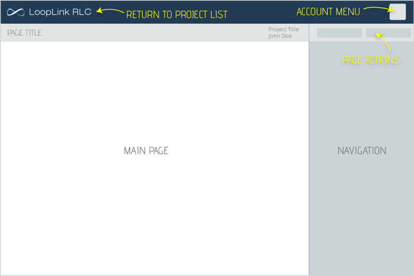

# Basic Navigation
LoopLink RLC will adapt its layout to your screen size.  This enables you to more easily access and modify your projects on a wide range of devices and screen sizes. On smaller screens, a tray of buttons will be available at the bottom of the screen allowing you to toggle between the Main Page and Navigation sections of the screen.

### Return to Project List
Regardless of your screen size, the logo at the top of your page will return you to your Project List.

### Account Menu
The Account Badge is located to the right of the logo in the page header. Clicking on the badge will open the Account Menu allowing access to:

1. Your Project List
2. Account Settings
3. Log Out

# Project List
The project list is a table of all of the projects you have created within LoopLink RLC. By default, the table is sorted in order of most recently modified.

## Create New Project
Click the Create New Project button found in the top right of your screen to start a new project.

## Project Actions
### Opening Projects
Click on the name of any project in your list to open the project.

### Print Project Report
Click  to directly go to the Project Summary page. This allows you to quickly generate a pdf report for your project. If you are unable to click on the report link, your project is not able to printed due to errors or a lack of zones/hot water.

### Duplicate Project
Click  to create an exact copy of a project. The copied project will open to the Project Details page. The new project will be automatically renamed.

### Delete Project
Click  to permanently delete a project. You will be asked to confirm that you would like to delete the project prior to any action being taken.

## Table Actions
### Sorting Projects
Reorder your project list by clicking on the table header corresponding to the property you would like to sort by.

### Finding Projects
Search for a specific project by name of project or the name of customer.
