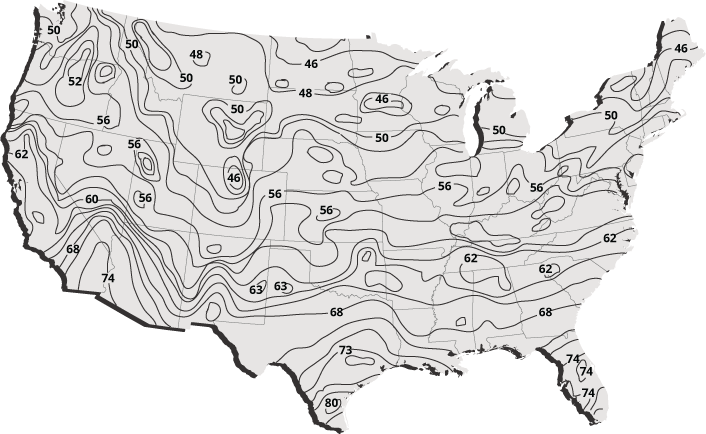

#Project Details

##Bin Data Location 
Select the weather location and outdoor air design temperatures for the project. 

**Bin Data City:** Select the location nearest to the actual project location. Bin data is the weather data used for energy usage calculations. 

For more information on the Bin Method, see Section 3.6 (Chapter 3, pages 29-45) IGSHPA's *Ground Source Heat Pump Residential and Light Commercial Design and Installation Guide.* 

**ASHRAE Heating Conditions:** Select the outdoor air temperature (OAT) at which the peak heating load calculations were performed. A 99% design OAT means that, on average, the outdoor temperature will be above this temperature for 99% of the hours in a given year (approximately 8,672 hours). A 99.6% design OAT means that, on average, the outdoor temperature will be above this temperature for 99.6% of the hours in a given year (approximately 8,725 hours). 

**ASHRAE Cooling Conditions:** Select the outdoor air temperature (OAT) at which the peak cooling load calculations were performed. A 1.0% design OAT means that, on average, the outdoor temperature will be above this temperature for 1% of the hours in a given year (approximately 88 hours). A 0.4% design OAT means that, on average, the outdoor temperature will be above this temperature for 0.4% of the hours in a given year (approximately 35 hours).

##Building Type 
Choose the building type that most closely resembles your project. This selection will set the default values for the heating start and cooling start temperatures for the project. The default heating and cooling start values can be modified on each zone as they are added to the project.

##System Design Details 
Specify the design temperatures used for the project. 

**Open-Loop:** Check this box if an open-loop ground connection will be used. Leave it unchecked for a closed-loop application. 

For more information on open-loop configurations, see Figures 1.2a, 1.2b, and 1.2c (Chapter 1, pages 8 & 9) of IGSHPA's *Ground Source Heat Pump Residential and Light Commercial Design and Installation Guide.* 

**Maximum EWT:** The maximum entering water temperature the closed-loop ground connection will be designed to provide under peak cooling conditions, typically assumed to be 90 degrees F in cooling-dominant applications. 

For more information on guidelines to follow when selecting maximum entering water temperature see Section 2.7.1.2 (Chapter 2, page 71) in IGSHPA's *Ground Source Heat Pump Residential and Light Commercial Design and Installation Guide.* 

**Minimum EWT:** The minimum entering water temperature the closed-loop ground connection will be designed to provide under peak heating conditions, typically assumed to be 30 degrees F in heating-dominant applications. 

For more information on guidelines to follow when selecting minimum entering water temperature see Section 2.7.1.1 (Chapter 2, page 70) in IGSHPA's *Ground Source Heat Pump Residential and Light Commercial Design and Installation Guide.* 

**Deep Earth Temp:** The temperature of the soil, which can be assumed to be constant starting at a depth of 20 feet below the surface down to about 200 feet below the surface. Deep earth temperature varies with location and weather conditions but is typically assumed to be 1-2 degrees above the average air temperature for the given location. 

For more information on deep earth temperature, refer to Section 5.2.2.1 (Chapter 5, pages 24 & 25) in IGSHPA's *Ground Source Heat Pump Residential and Light Commercial Design and Installation Guide.*

**Well Water Temp:** The temperature of well water to be drawn through the GSHP equipment in an open loop configuration. Well water temperature varies with location and weather conditions and can typically be assumed to be the same as deep earth temperature for a given location. 

For a detailed map on approximate ground water temperatures for various locations across the U.S. see Figure 5.11 (Chapter 5, page 25) in IGSHPA's *Ground Source Heat Pump Residential and Light Commercial Design and Installation Guide.* 

**Static Water Level:** The depth of the water level below the ground surface, used to calculate pumping power requirements associated with "lifting head" for open loop systems.