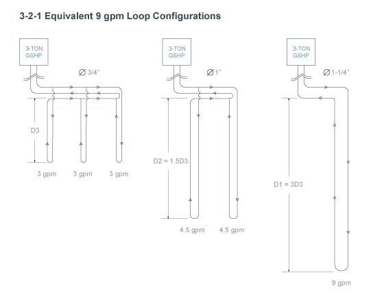
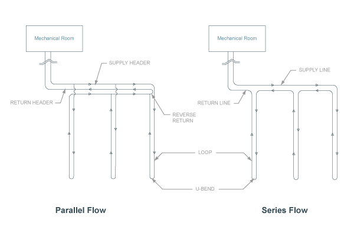

##Formation Details
**Average Formation Thermal Conductivity:** The thermal conductivity (Btu/hr-ft-F) of the soil. Formation thermal conductivity is dependent on soil or rock type, moisture content, and density. For large systems (>25 tons), a formation thermal conductivity test (FTC test, in-situ test) is recommended to directly measure soil properties. Thermal conductivity is a measure of how fast heat moves through a material due to a temperature difference. 

**Calculate Estimate:** Click this button to open an interactive calculator that will enable you to estimate your formation thermal conductivity based on a weighted average of soil/rock properites from a drill log.

## Thermal Property Ranges of Selected Soils &amp; Rocks
<table cellspacing="0" cellpadding="0">
<thead>
 <tr>
    <td colspan="4"><h2>SOILS</h2></td>
  </tr>
  <tr>
    <td width="175" class="topLeft" >&nbsp;</td>
  <td width="120"class="heading" >Dry Density 
        (lb/ft3)</td>
    <td width="148" class="heading">Thermal Conductivity 
        (Btu/hr ft F)</td>
    <td width="148" class="heading">Thermal Diffusivity 
        (ft2/day)</td>
  </tr>
 </thead>
 <tbody>
  <tr>
    <td width="175" class="leftIndent" >Heavy    Clay - 15% water</td>
    <td width="120" class="centeredData" >120</td>
    <td width="148" class="centeredData" >0.8 - 1.1</td>
    <td width="148" class="centeredData" >0.45 - 0.65</td>
  </tr>
  <tr class="alternatingCell">
    <td width="175" class="leftIndent" >Heavy    Clay - 5 % water</td>
    <td width="120" class="centeredData" >120</td>
    <td width="148" class="centeredData" >0.6 - 0.8</td>
    <td width="148" class="centeredData" >0.50 - 0.65</td>
  </tr>
  <tr>
    <td width="175" class="leftIndent" >Light    Clay - 15% water</td>
    <td width="120" class="centeredData" >80</td>
    <td width="148" class="centeredData" >0.4 - 0.6</td>
    <td width="148" class="centeredData" >0.35 - 0.50</td>
  </tr>
  <tr class="alternatingCell">
    <td width="175" class="leftIndent" >Light    Clay - 5 % water</td>
    <td width="120" class="centeredData" >80</td>
    <td width="148" class="centeredData" >0.3 - 0.5</td>
    <td width="148" class="centeredData" >0.35 - 0.60</td>
  </tr>
  <tr>
    <td width="175" class="leftIndent" >Heavy    Sand - 15% water</td>
    <td width="120" class="centeredData" >120</td>
    <td width="148" class="centeredData" >1.6 - 2.2</td>
    <td width="148" class="centeredData" >0.9 - 1.2</td>
  </tr>
  <tr class="alternatingCell">
    <td width="175" class="leftIndent" >Heavy Sand - 5 % water</td>
    <td width="120" class="centeredData" >120</td>
    <td width="148" class="centeredData" >1.2 - 1.9</td>
    <td width="148" class="centeredData" >1.0 - 1.5</td>
  </tr>
  <tr>
    <td width="175" class="leftIndent" >Light Sand - 15% water</td>
    <td width="120" class="centeredData" >80</td>
    <td width="148" class="centeredData" >0.6 - 1.2</td>
    <td width="148" class="centeredData" >0.5 - 1.0</td>
  </tr>
  <tr class="alternatingCell">
    <td width="175" class="leftIndent" >Light    Sand - 5 % water</td>
    <td width="120" class="centeredData" >80</td>
    <td width="148" class="centeredData" >0.5 - 1.1</td>
    <td width="148" class="centeredData" >0.6 - 1.3</td>
  </tr>
  </tbody>
  </table>
  *Source: Kavanaugh and Rafferty (1997)*
  
<table>
<thead>
  <tr>
    <td colspan="4"><h2>ROCKS</h2></td>
  </tr>
   <tr>
    <td width="175" class="topLeft" >&nbsp;</td>
  <td width="120"class="heading" >Dry Density 
        (lb/ft3)</td>
    <td width="148" class="heading">Thermal Conductivity 
        (Btu/hr ft F)</td>
    <td width="148" class="heading">Thermal Diffusivity 
        (ft2/day)</td>
  </tr>
  </thead>
  <tbody>
  <tr>
    <td width="175" class="leftIndent" >Granite</td>
    <td width="120" class="centeredData" >165</td>
    <td width="148" class="centeredData" >1.3 - 2.1</td>
    <td width="148" class="centeredData" >0.9 - 1.4</td>
  </tr>
  <tr class="alternatingCell">
    <td width="175" class="leftIndent" >Limestone</td>
    <td width="120" class="centeredData" >150 - 175</td>
    <td width="148" class="centeredData" >1.4 - 2.2</td>
    <td width="148" class="centeredData" >0.9 - 1.4</td>
  </tr>
  <tr>
    <td width="175" class="leftIndent" >Sandstone</td>
    <td width="120" class="centeredData" >160 - 170</td>
    <td width="148" class="centeredData" >1.2 - 2.0</td>
    <td width="148" class="centeredData" >0.7 - 1.2</td>
  </tr>
  <tr class="alternatingCell">
    <td width="175" class="leftIndent" >Shale    - Wet</td>
    <td width="120" class="centeredData" >130 - 165</td>
    <td width="148" class="centeredData" >0.8 - 1.4</td>
    <td width="148" class="centeredData" >0.7 - 0.9</td>
  </tr>
  <tr>
    <td width="175" class="leftIndent" >Shale - Dry</td>
    <td width="120" class="centeredData" >130 - 165</td>
    <td width="148" class="centeredData" >0.6 - 1.2</td>
    <td width="148" class="centeredData" >0.6 - 0.8</td>
  </tr>
  </tbody>
</table>
*Source: Kavanaugh and Rafferty (1997)*

For more information on soil properties, refer to Section 5.2.2.2 and Table 5.6 (Chapter 5, pages 26-29) in IGSHPA's *Ground Source Heat Pump Residential and Light Commercial Design and Installation Guide.* 

Users in the U.S.A. may reference the [USDA Printed Surveys](http://soils.usda.gov/survey/printed_surveys) for detailed soil information by state and county.

##Layout Details
**Bore Diameter:** The diameter of the borehole being drilled for insertion of the GHEX piping. Common borehole diameters range from 4"-6", depending on drilling conditions and the size of the u-bend piping being utilized. 

**U-Bend Material:** The material from which the u-bend is made.  Different materials exhibit different resistance to heat transfer as a result the selection of material will impact loop lengths.

**U-Bend Nominal Diameter:** The u-bend nominal diameter to be used in the active section of the GHEX. The available diameters will vary depending on the piping material selected.

***Refer to the figure below to view the correlation between u-bend pipe diameter, vertical bore depth, and gpm per flow path:*** 
 

For more information about proper pipe selection, refer to Section 5.1.3 and Figures 5.4-5.5 (Chapter 5, pages 5-8) in IGSHPA's *Ground Source Heat Pump Residential and Light Commercial Design and Installation Guide.* 

**Layout Rows:** The number of rows to be used in the vertically-bored GHEX layout. A 2x3 [rows x bores per row] rectangular loopfield layout would have 2 rows with 3 bores in each row for a total of 6 bores. 

**Bores per Row:** The number of bores in each row to be used in the vertically-bored GHEX layout. A 2 x 3 [rows x bores per row] rectangular loopfield layout would have 2 rows with 3 bores in each row for a total of 6 bores. 

**Bore Spacing:** The center-center spacing between bores. 

**Number of Bores in Series:** The number of bores in series before the circuit is attached to the header. Use 1 for a value for a basic parallel-type GHEX configuration. Adjust the value (>1) when a series-parallel system is used. A series-type GHEX configuration is not recommended. 

***Refer to the figure below to view the difference between a system with 1-, 2-, and 3-bores-in-series.***
 

***Refer to the figure below to view the difference between the series-type and the parallel-type GHEX configurations:*** 
 

**Grout Thermal Conductivity:** The thermal conductivity (Btu/hr-ft-F) of the grouting material to be placed into the borehole after insertion of the u-bend. Thermal conductivity is a measure of how fast heat moves through a material due to a temperature difference.

##Fixed Length Mode
Check this box to use **Fixed Length Mode**. When enabled, specify the target bore depth and configuration (number of bores, bore spacing, grout thermal conductivity, etc. and the program will calculate the minimum and maximum EWT's that will be supplied by the specified ground heat exchanger configuration. 

**Fixed Length Mode** is only available for one GHEX configuration per project. All other GHEX design calculations will be performed such that they will provide the same EWT's as the configuration with **Fixed Length Mode** Enabled.

##GHEX Summary
View the results of the calculations performed according to the specified design parameters. 

**Deep Earth Temp:** The temperature of the soil, which can be assumed to be constant starting at a depth of 20 feet below the surface down to about 200 feet below the surface. Deep earth temperature varies with location and weather conditions. This parameter is specified on the **PROJECT DETAILS** page. 

**Number of Bores:** The total number of bores in the GHEX, calculated by taking the number of rows multiplied by the number of bores per row. 

**Bore Multiplier:** This parameter is used to account for long-term draw-down or build-up of energy in the loopfield in unbalanced ground load situations. Bore multiplier is a function of the normalized net annual ground load, GHEX design (bore layout, number of bores, and center-center spacing) and soil properties (thermal conductivity and thermal diffusivity). 

**NNAGL (Normalized Net Annual Ground Load):** The net annual ground load divided by the design length (unadjusted for long-term effects) and the temperature difference between the deep earth and the average circulating fluid under design conditions. This parameter is used to determine the bore multiplier (see Bore Mult. below) to account for long-term draw-down or build-up of energy in the loopfield in unbalanced ground load situations. 

**GPM per Flow Path:** The design flow rate (gpm, gallons per minute) through each parallel flow path in the GHEX. The system should be designed such that the design flow rate is approximately 3 gpm per flow path for 3/4" u-bends, 4.5 gpm per flow path for 1" u-bends, and 6-9 gpm per flow path for 1-1/4" u-bends. 

**Number of Flow Paths:** The total number of parallel flow paths in the GHEX, calculated by taking the total number of bores divided by the number of bores in series. 

**System Flow Rate:** The total system flow rate (gpm, gallons per minute) to be circulated through the GHEX, determined by the flow rate required by the GSHP equipment selected to serve the zones in the system.
###Heating
**EWTmin:** The minimum entering water temperature the closed-loop ground connection will be designed to provide under peak heating conditions, typically assumed to be 30 degrees F in heating-dominant applications. This parameter is specified on the PROJECT DETAILS page. 

**Ground Loop Resistance:** The heat transfer resistance (hr-ft-F/Btu) in the borehole in the heating mode. Bore resistance is a function of run fraction during the heating design month (January), bore diameter, u-bend pipe diameter, spacing of the pipes in the borehole, formation thermal conductivity, and grout thermal conductivity. 

**System Run Fraction:** A measure of equipment run-time during the design month in heating (January), expressed as a decimal. A 0.600 run fraction means that the equipment will run approximately 60% of the time during the design month. Run fraction is a function of equipment capacity as it relates to building load and weather data for the geographical location. 

**Bore Depth:** The depth of each bore required to maintain the minimum entering water temperature given the parameters used to design the GHEX in the heating mode during the first year of system operation. This parameter does not account for unbalanced ground loads. 

**Adjusted Bore Depth:** The depth of each bore required to accommodate unbalanced ground loads over the long term while maintaining the specified minimum entering water temperature in the heating mode. 

Imbalanced annual ground loads can result in a long-term ground temperature increase or decrease at the center of the loopfield. This temperature change reduces heat exchanger capacity. The **Adjusted Bore Depth** is the individual bore depth required to account for this temperature change, which typically occurs within the first 10 years of system operation. Designing with this length ensures that the maximum and minimum entering water temperatures to the heat pumps (EWT's) stay within specification 10 years after system startup or until steady state conditions are achieved. This length does not take into account groundwater movement in the vertical or horizontal directions.
###Cooling
**EWTmax:** The maximum entering water temperature the closed-loop ground connection will be designed to provide under peak cooling conditions, typically assumed to be 90 degrees F in cooling-dominant applications. This parameter is specified on the PROJECT DETAILS page. 

**Ground Loop Resistance:** The heat transfer resistance (hr-ft-F/Btu) in the borehole in the cooling mode. Bore resistance is a function of run fraction during the cooling design month (July), bore diameter, u-bend pipe diameter, spacing of the pipes in the borehole, formation thermal conductivity, and grout thermal conductivity. 

**System Run Fraction:** A measure of equipment run-time during the design month in cooling (July), expressed as a decimal. A 0.600 run fraction means that the equipment will run approximately 60% of the time during the design month. Run fraction is a function of equipment capacity as it relates to building load and weather data for the geographical location. 

**Bore Depth:** The depth of each bore required to maintain the maximum entering water temperature given the parameters used to design the GHEX in the cooling mode during the first year of system operation. This parameter does not account for unbalanced ground loads. 

**Adjusted Bore Depth:** The depth of each bore required to accommodate unbalanced ground loads over the long term while maintaining the specified maximum entering water temperature in the cooling mode. 

Imbalanced annual ground loads can result in a long-term ground temperature increase or decrease at the center of the loopfield. This temperature change reduces heat exchanger capacity. The **Adjusted Bore Depth** is the individual bore depth required to account for this temperature change, which typically occurs within the first 10 years of system operation. Designing with this length ensures that the maximum and minimum entering water temperatures to the heat pumps (EWT's) stay within specification 10 years after system startup or until steady state conditions are achieved. This length does not take into account groundwater movement in the vertical or horizontal directions. 

***The GHEX design length for a given system will be determined by whichever design is dominant (i.e. - whichever GHEX design length is longer).*** 

All design length calculations are performed according to the procedures given in Section 5.2 (Chapter 5, pages 21-48) in IGSHPA's *Ground Source Heat Pump Residential and Light Commercial Design and Installation Guide.* 
